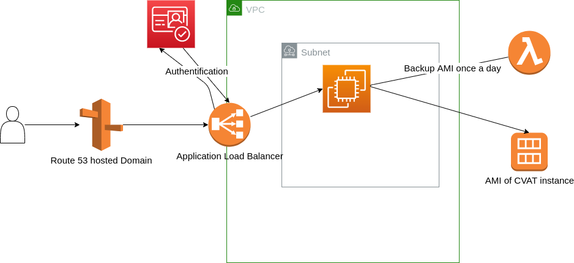

# CVAT on AWS

Full deployment guide for CVAT on AWS

## Prerequisite

    - An AWS account
    - CDK >= 2.41
    - boostraped CDK environment
    - A hosted zone (Route53)

## Usage

    CVAT_AWS_HZ_ID=<hosted-zone-id> CVAT_AWS_DOMAIN=<your-domain-name> cdk deploy --all
